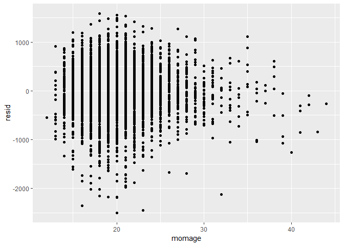
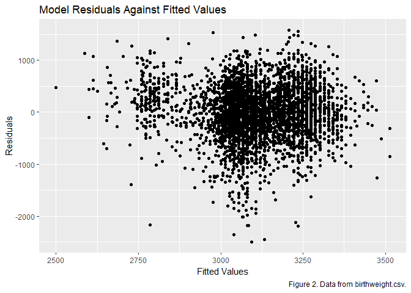
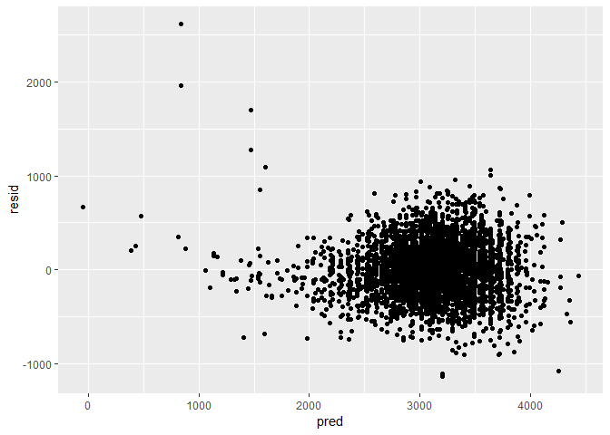

P8105\_HW6\_BJL2150
================
Briana Lettsome
November 16, 2018

Problem 1
=========

``` r
# Reading in the homicide data set
homicide_data = read_csv("./homicidedata.csv", na = c("", "NA", "Unknown")) 
```

    ## Parsed with column specification:
    ## cols(
    ##   uid = col_character(),
    ##   reported_date = col_integer(),
    ##   victim_last = col_character(),
    ##   victim_first = col_character(),
    ##   victim_race = col_character(),
    ##   victim_age = col_integer(),
    ##   victim_sex = col_character(),
    ##   city = col_character(),
    ##   state = col_character(),
    ##   lat = col_double(),
    ##   lon = col_double(),
    ##   disposition = col_character()
    ## )

read\_csv(file = "./homicidedata.csv")

### Description of the homicide dataset:

The homicide\_data provides information on the numbers of homicides committed within fifty large U.S. cities. Within the dataset, the observations included are the vitcims' first and last name, age, race, city and state that the event transpired in as well as the disposition. The disposition in this context refers to the result of the homicide event. In other words, was the case closed, an arrest made, unsolved, et cetera.

``` r
# Making of the new variable 'city_state'. Also, created a binary variable from disposition and named this new observation 'solved'. Where 1 = "Closed by arrest" and = "Open/ no arrest" and "Closed withou arrest".

# Using this dataframe to count how many states are in the original dataset prior to filtering out the 4 city_state observations. 

two_homicide_citystate = homicide_data %>%
  mutate(city_state = str_c(city, ", " , state)) %>%
  mutate(solved = as.numeric(disposition == "Closed by arrest")) %>% 
  count(city_state)  

# This is the working dataframe where the 4 cities were filtered out successfully. The 

homicide_citystate = homicide_data %>%
  mutate(city_state = str_c(city, ", " , state)) %>% 
  mutate(solved = as.numeric(disposition == "Closed by arrest")) %>% 
  filter(!city_state %in% c("Dallas, TX", "Phoenix, AZ", "Kansas City, MO", "Tulsa, AL")) %>%
  select(city_state, victim_race, solved, victim_age, victim_sex, disposition) %>%
  mutate(race = case_when(victim_race == "White" ~ "white",
                          victim_race != "White" ~ "non-white")) %>%
  mutate(victim_age = as.numeric(victim_age)) %>%
  mutate(race = fct_relevel(race, "white")) %>%
  filter(race != "" & victim_age != "")
```

``` r
baltimore = homicide_citystate %>%
  filter(city_state == "Baltimore, MD")

## Using the 'glm' function

glm(solved ~ victim_age + race + victim_sex, data = baltimore, family = binomial()) %>%
  broom::tidy(conf.int = TRUE) %>%
  mutate(OR = exp(estimate)) %>%
  mutate(exp_conf_low = exp(conf.low)) %>%
  mutate(exp_conf_high = exp(conf.high)) %>%
  select(term, OR, exp_conf_low, exp_conf_high, p.value) %>%
  knitr::kable(digits = 3)
```

| term            |     OR|  exp\_conf\_low|  exp\_conf\_high|  p.value|
|:----------------|------:|---------------:|----------------:|--------:|
| (Intercept)     |  3.274|           2.076|            5.212|    0.000|
| victim\_age     |  0.993|           0.987|            0.999|    0.032|
| racenon-white   |  0.441|           0.312|            0.620|    0.000|
| victim\_sexMale |  0.412|           0.315|            0.537|    0.000|

``` r
city_state_glm = homicide_citystate %>%
  group_by(city_state) %>%
  nest()%>%
  mutate(models = map(data, ~glm(solved ~ victim_age + race + victim_sex, data = .x, family = binomial())),
models = map(models, broom::tidy, conf.int = TRUE)) %>%
  select(-data) %>% 
  unnest() %>%
  mutate(OR = exp(estimate),
       exp_conf_low = exp(conf.low),
       exp_conf_high = exp(conf.high))

city_state_glm %>%
  select(city_state, OR, exp_conf_low, exp_conf_high, p.value) %>%
  knitr::kable(digits = 3)
```

| city\_state        |      OR|  exp\_conf\_low|  exp\_conf\_high|  p.value|
|:-------------------|-------:|---------------:|----------------:|--------:|
| Albuquerque, NM    |   3.409|           1.608|            7.512|    0.002|
| Albuquerque, NM    |   0.977|           0.963|            0.991|    0.001|
| Albuquerque, NM    |   0.739|           0.445|            1.220|    0.240|
| Albuquerque, NM    |   1.629|           0.917|            2.884|    0.094|
| Atlanta, GA        |   3.165|           1.574|            6.519|    0.001|
| Atlanta, GA        |   0.988|           0.979|            0.997|    0.010|
| Atlanta, GA        |   0.753|           0.424|            1.299|    0.317|
| Atlanta, GA        |   0.990|           0.676|            1.439|    0.958|
| Baltimore, MD      |   3.274|           2.076|            5.212|    0.000|
| Baltimore, MD      |   0.993|           0.987|            0.999|    0.032|
| Baltimore, MD      |   0.441|           0.312|            0.620|    0.000|
| Baltimore, MD      |   0.412|           0.315|            0.537|    0.000|
| Baton Rouge, LA    |   4.231|           1.591|           11.978|    0.005|
| Baton Rouge, LA    |   0.997|           0.982|            1.011|    0.646|
| Baton Rouge, LA    |   0.668|           0.304|            1.405|    0.296|
| Baton Rouge, LA    |   0.389|           0.212|            0.687|    0.002|
| Birmingham, AL     |   1.955|           0.946|            4.088|    0.072|
| Birmingham, AL     |   0.991|           0.981|            1.000|    0.055|
| Birmingham, AL     |   1.039|           0.612|            1.754|    0.886|
| Birmingham, AL     |   0.880|           0.580|            1.326|    0.544|
| Boston, MA         |  11.596|           4.062|           38.079|    0.000|
| Boston, MA         |   1.004|           0.990|            1.019|    0.562|
| Boston, MA         |   0.127|           0.047|            0.285|    0.000|
| Boston, MA         |   0.472|           0.268|            0.814|    0.008|
| Buffalo, NY        |   1.729|           0.697|            4.380|    0.241|
| Buffalo, NY        |   1.011|           0.997|            1.025|    0.120|
| Buffalo, NY        |   0.392|           0.211|            0.714|    0.002|
| Buffalo, NY        |   0.553|           0.317|            0.965|    0.037|
| Charlotte, NC      |   5.294|           2.472|           11.828|    0.000|
| Charlotte, NC      |   0.996|           0.984|            1.008|    0.512|
| Charlotte, NC      |   0.558|           0.313|            0.951|    0.038|
| Charlotte, NC      |   0.872|           0.561|            1.332|    0.532|
| Chicago, IL        |   1.154|           0.819|            1.626|    0.412|
| Chicago, IL        |   1.005|           1.001|            1.010|    0.028|
| Chicago, IL        |   0.562|           0.432|            0.734|    0.000|
| Chicago, IL        |   0.416|           0.348|            0.497|    0.000|
| Cincinnati, OH     |  10.553|           4.817|           24.476|    0.000|
| Cincinnati, OH     |   0.990|           0.979|            1.002|    0.092|
| Cincinnati, OH     |   0.318|           0.180|            0.541|    0.000|
| Cincinnati, OH     |   0.394|           0.228|            0.657|    0.001|
| Columbus, OH       |   1.308|           0.810|            2.120|    0.274|
| Columbus, OH       |   1.008|           0.999|            1.017|    0.081|
| Columbus, OH       |   0.861|           0.638|            1.161|    0.325|
| Columbus, OH       |   0.535|           0.382|            0.746|    0.000|
| Denver, CO         |   3.309|           1.486|            7.621|    0.004|
| Denver, CO         |   0.990|           0.976|            1.004|    0.149|
| Denver, CO         |   0.602|           0.358|            1.008|    0.054|
| Denver, CO         |   0.428|           0.241|            0.748|    0.003|
| Detroit, MI        |   1.524|           1.027|            2.267|    0.037|
| Detroit, MI        |   1.003|           0.997|            1.009|    0.359|
| Detroit, MI        |   0.652|           0.488|            0.870|    0.004|
| Detroit, MI        |   0.571|           0.454|            0.718|    0.000|
| Durham, NC         |   3.067|           1.035|            9.897|    0.050|
| Durham, NC         |   0.994|           0.977|            1.011|    0.491|
| Durham, NC         |   1.003|           0.390|            2.452|    0.995|
| Durham, NC         |   0.628|           0.303|            1.241|    0.193|
| Fort Worth, TX     |   2.828|           1.495|            5.445|    0.002|
| Fort Worth, TX     |   0.981|           0.970|            0.992|    0.001|
| Fort Worth, TX     |   0.838|           0.553|            1.264|    0.401|
| Fort Worth, TX     |   0.837|           0.546|            1.279|    0.414|
| Fresno, CA         |   7.104|           2.785|           19.378|    0.000|
| Fresno, CA         |   0.998|           0.985|            1.010|    0.702|
| Fresno, CA         |   0.445|           0.221|            0.841|    0.017|
| Fresno, CA         |   0.538|           0.293|            0.947|    0.038|
| Houston, TX        |   1.760|           1.277|            2.430|    0.001|
| Houston, TX        |   0.994|           0.989|            0.999|    0.011|
| Houston, TX        |   0.873|           0.698|            1.090|    0.230|
| Houston, TX        |   0.723|           0.596|            0.877|    0.001|
| Indianapolis, IN   |   2.915|           1.894|            4.531|    0.000|
| Indianapolis, IN   |   0.993|           0.985|            1.001|    0.070|
| Indianapolis, IN   |   0.505|           0.381|            0.665|    0.000|
| Indianapolis, IN   |   0.876|           0.654|            1.171|    0.375|
| Jacksonville, FL   |   2.092|           1.377|            3.200|    0.001|
| Jacksonville, FL   |   0.993|           0.986|            1.001|    0.085|
| Jacksonville, FL   |   0.658|           0.502|            0.862|    0.002|
| Jacksonville, FL   |   0.715|           0.535|            0.954|    0.023|
| Las Vegas, NV      |   2.321|           1.560|            3.475|    0.000|
| Las Vegas, NV      |   0.995|           0.989|            1.002|    0.177|
| Las Vegas, NV      |   0.763|           0.591|            0.981|    0.036|
| Las Vegas, NV      |   0.940|           0.724|            1.218|    0.643|
| Long Beach, CA     |   2.426|           0.858|            7.256|    0.102|
| Long Beach, CA     |   1.008|           0.994|            1.024|    0.274|
| Long Beach, CA     |   0.794|           0.379|            1.606|    0.528|
| Long Beach, CA     |   0.510|           0.262|            0.952|    0.040|
| Los Angeles, CA    |   1.817|           1.157|            2.872|    0.010|
| Los Angeles, CA    |   1.004|           0.998|            1.010|    0.187|
| Los Angeles, CA    |   0.666|           0.481|            0.916|    0.013|
| Los Angeles, CA    |   0.673|           0.518|            0.872|    0.003|
| Louisville, KY     |   6.118|           3.168|           12.215|    0.000|
| Louisville, KY     |   0.990|           0.978|            1.001|    0.078|
| Louisville, KY     |   0.392|           0.257|            0.590|    0.000|
| Louisville, KY     |   0.480|           0.296|            0.765|    0.002|
| Memphis, TN        |   5.892|           3.415|           10.354|    0.000|
| Memphis, TN        |   0.984|           0.977|            0.992|    0.000|
| Memphis, TN        |   0.778|           0.516|            1.154|    0.221|
| Memphis, TN        |   0.719|           0.528|            0.970|    0.033|
| Miami, FL          |   1.485|           0.707|            3.149|    0.298|
| Miami, FL          |   0.997|           0.985|            1.010|    0.669|
| Miami, FL          |   0.577|           0.376|            0.885|    0.012|
| Miami, FL          |   0.527|           0.315|            0.883|    0.015|
| Milwaukee, wI      |   4.934|           2.713|            9.190|    0.000|
| Milwaukee, wI      |   0.988|           0.980|            0.997|    0.009|
| Milwaukee, wI      |   0.632|           0.398|            0.982|    0.046|
| Milwaukee, wI      |   0.747|           0.523|            1.056|    0.103|
| Minneapolis, MN    |   1.215|           0.484|            3.083|    0.678|
| Minneapolis, MN    |   1.010|           0.995|            1.025|    0.213|
| Minneapolis, MN    |   0.646|           0.341|            1.204|    0.172|
| Minneapolis, MN    |   0.858|           0.458|            1.599|    0.628|
| Nashville, TN      |   2.023|           1.193|            3.471|    0.010|
| Nashville, TN      |   0.997|           0.987|            1.007|    0.581|
| Nashville, TN      |   0.902|           0.655|            1.239|    0.527|
| Nashville, TN      |   1.017|           0.674|            1.519|    0.935|
| New Orleans, LA    |   3.077|           1.658|            5.765|    0.000|
| New Orleans, LA    |   0.981|           0.971|            0.990|    0.000|
| New Orleans, LA    |   0.467|           0.295|            0.739|    0.001|
| New Orleans, LA    |   0.615|           0.446|            0.849|    0.003|
| New York, NY       |   5.152|           2.208|           12.721|    0.000|
| New York, NY       |   1.009|           0.998|            1.020|    0.116|
| New York, NY       |   0.532|           0.271|            0.989|    0.054|
| New York, NY       |   0.342|           0.207|            0.546|    0.000|
| Oakland, CA        |   6.207|           2.736|           15.181|    0.000|
| Oakland, CA        |   1.004|           0.994|            1.014|    0.403|
| Oakland, CA        |   0.213|           0.099|            0.418|    0.000|
| Oakland, CA        |   0.479|           0.323|            0.704|    0.000|
| Oklahoma City, OK  |   1.900|           1.117|            3.261|    0.019|
| Oklahoma City, OK  |   0.995|           0.984|            1.005|    0.297|
| Oklahoma City, OK  |   0.681|           0.477|            0.970|    0.034|
| Oklahoma City, OK  |   0.824|           0.556|            1.218|    0.332|
| Omaha, NE          |  11.292|           4.655|           29.276|    0.000|
| Omaha, NE          |   1.002|           0.986|            1.018|    0.776|
| Omaha, NE          |   0.170|           0.091|            0.300|    0.000|
| Omaha, NE          |   0.381|           0.202|            0.689|    0.002|
| Philadelphia, PA   |   3.707|           2.474|            5.601|    0.000|
| Philadelphia, PA   |   1.000|           0.994|            1.005|    0.885|
| Philadelphia, PA   |   0.644|           0.485|            0.850|    0.002|
| Philadelphia, PA   |   0.466|           0.362|            0.596|    0.000|
| Pittsburgh, PA     |   4.588|           2.131|           10.271|    0.000|
| Pittsburgh, PA     |   1.005|           0.992|            1.017|    0.452|
| Pittsburgh, PA     |   0.282|           0.157|            0.485|    0.000|
| Pittsburgh, PA     |   0.452|           0.277|            0.727|    0.001|
| Richmond, VA       |  10.181|           2.736|           44.069|    0.001|
| Richmond, VA       |   0.980|           0.961|            0.999|    0.040|
| Richmond, VA       |   0.447|           0.144|            1.150|    0.121|
| Richmond, VA       |   0.932|           0.448|            1.844|    0.845|
| San Antonio, TX    |   3.075|           1.709|            5.609|    0.000|
| San Antonio, TX    |   0.987|           0.978|            0.996|    0.006|
| San Antonio, TX    |   0.689|           0.459|            1.026|    0.069|
| San Antonio, TX    |   0.900|           0.633|            1.274|    0.556|
| Sacramento, CA     |   2.808|           1.191|            6.849|    0.020|
| Sacramento, CA     |   1.004|           0.991|            1.018|    0.528|
| Sacramento, CA     |   0.781|           0.443|            1.348|    0.381|
| Sacramento, CA     |   0.599|           0.325|            1.065|    0.089|
| Savannah, GA       |   1.792|           0.612|            5.444|    0.292|
| Savannah, GA       |   1.001|           0.982|            1.020|    0.935|
| Savannah, GA       |   0.605|           0.279|            1.277|    0.193|
| Savannah, GA       |   0.898|           0.434|            1.842|    0.770|
| San Bernardino, CA |   0.668|           0.178|            2.483|    0.546|
| San Bernardino, CA |   1.012|           0.993|            1.032|    0.212|
| San Bernardino, CA |   0.880|           0.394|            1.999|    0.756|
| San Bernardino, CA |   0.640|           0.311|            1.323|    0.224|
| San Diego, CA      |   4.411|           2.004|           10.063|    0.000|
| San Diego, CA      |   0.996|           0.984|            1.008|    0.478|
| San Diego, CA      |   0.483|           0.294|            0.778|    0.003|
| San Diego, CA      |   0.689|           0.421|            1.110|    0.132|
| San Francisco, CA  |   1.427|           0.638|            3.259|    0.391|
| San Francisco, CA  |   1.024|           1.013|            1.036|    0.000|
| San Francisco, CA  |   0.458|           0.288|            0.719|    0.001|
| San Francisco, CA  |   0.540|           0.309|            0.922|    0.026|
| St. Louis, MO      |   2.196|           1.328|            3.657|    0.002|
| St. Louis, MO      |   0.995|           0.987|            1.003|    0.197|
| St. Louis, MO      |   0.577|           0.405|            0.819|    0.002|
| St. Louis, MO      |   0.713|           0.538|            0.943|    0.018|
| Stockton, CA       |   1.592|           0.658|            3.923|    0.305|
| Stockton, CA       |   0.999|           0.986|            1.012|    0.862|
| Stockton, CA       |   0.376|           0.193|            0.713|    0.003|
| Stockton, CA       |   1.034|           0.592|            1.835|    0.907|
| Tampa, FL          |   1.675|           0.547|            5.319|    0.371|
| Tampa, FL          |   0.997|           0.979|            1.016|    0.769|
| Tampa, FL          |   1.159|           0.585|            2.293|    0.671|
| Tampa, FL          |   0.657|           0.292|            1.424|    0.295|
| Tulsa, OK          |   3.316|           1.898|            5.920|    0.000|
| Tulsa, OK          |   0.995|           0.983|            1.006|    0.363|
| Tulsa, OK          |   0.596|           0.406|            0.866|    0.007|
| Tulsa, OK          |   0.997|           0.645|            1.527|    0.989|
| Washington, DC     |   4.372|           1.925|           10.355|    0.001|
| Washington, DC     |   0.992|           0.984|            1.000|    0.063|
| Washington, DC     |   0.514|           0.252|            0.997|    0.056|
| Washington, DC     |   0.685|           0.469|            0.990|    0.046|

unique(homicide\_citystate$city\_state)

Used this function to determine th unique observations within 'disposition'.
============================================================================

unique(homicide\_citystate$disposition)

Problem 2
=========

Problem 2.1
-----------

``` r
# Reading in of birthweight dataset and removing ony observations that are missing, NA or Unknown.

birthweight_data = read_csv("./birthweight.csv", na = c("", "NA", "Unknown")) 
```

    ## Parsed with column specification:
    ## cols(
    ##   .default = col_integer(),
    ##   gaweeks = col_double(),
    ##   ppbmi = col_double(),
    ##   smoken = col_double()
    ## )

    ## See spec(...) for full column specifications.

Problem 2.2
-----------

### Linear Regression model for birthweight.

``` r
birthweight_clean = birthweight_data %>%
  select(bwt, momage, mrace, smoken, babysex, bhead, blength, gaweeks) 

bw_linear_one = lm(bwt ~ momage + mrace + smoken, data = birthweight_clean)

bw_linear_one %>%
  broom::tidy()
```

    ## # A tibble: 4 x 5
    ##   term        estimate std.error statistic  p.value
    ##   <chr>          <dbl>     <dbl>     <dbl>    <dbl>
    ## 1 (Intercept)  3110.       47.5      65.5  0.      
    ## 2 momage         13.3       1.98      6.70 2.42e-11
    ## 3 mrace        -141.       10.2     -13.8  1.53e-42
    ## 4 smoken         -8.64      1.04     -8.34 9.58e-17

Problem 2.3
-----------

### Add::residuals and add::predictions to plot residuals against fitted values.

``` r
# Using the add::residuals and add:predictions to observe the output for my linear model.

modelr::add_residuals(birthweight_clean, bw_linear_one)
```

    ## # A tibble: 4,342 x 9
    ##      bwt momage mrace smoken babysex bhead blength gaweeks    resid
    ##    <int>  <int> <int>  <dbl>   <int> <int>   <int>   <dbl>    <dbl>
    ##  1  3629     36     1      0       2    34      51    39.9  182.   
    ##  2  3062     25     2      0       1    34      48    25.9  -98.2  
    ##  3  3345     29     1      1       2    36      50    39.9   -0.419
    ##  4  3062     18     1     10       1    34      52    40    -59.6  
    ##  5  3374     20     1      1       2    34      52    41.6  148.   
    ##  6  3374     23     1      0       1    33      52    40.7   99.6  
    ##  7  2523     29     2      0       2    33      46    40.3 -690.   
    ##  8  2778     19     1      0       2    33      49    37.4 -443.   
    ##  9  3515     13     1      0       1    36      52    40.3  373.   
    ## 10  3459     19     2      4       1    33      50    40.7  413.   
    ## # ... with 4,332 more rows

``` r
modelr::add_predictions(birthweight_clean, bw_linear_one)
```

    ## # A tibble: 4,342 x 9
    ##      bwt momage mrace smoken babysex bhead blength gaweeks  pred
    ##    <int>  <int> <int>  <dbl>   <int> <int>   <int>   <dbl> <dbl>
    ##  1  3629     36     1      0       2    34      51    39.9 3447.
    ##  2  3062     25     2      0       1    34      48    25.9 3160.
    ##  3  3345     29     1      1       2    36      50    39.9 3345.
    ##  4  3062     18     1     10       1    34      52    40   3122.
    ##  5  3374     20     1      1       2    34      52    41.6 3226.
    ##  6  3374     23     1      0       1    33      52    40.7 3274.
    ##  7  2523     29     2      0       2    33      46    40.3 3213.
    ##  8  2778     19     1      0       2    33      49    37.4 3221.
    ##  9  3515     13     1      0       1    36      52    40.3 3142.
    ## 10  3459     19     2      4       1    33      50    40.7 3046.
    ## # ... with 4,332 more rows

``` r
# Created a scatterplot plotting the residuals against the fitted values.

birthweight_clean %>% 
  modelr::add_residuals(bw_linear_one) %>% 
  modelr::add_predictions(bw_linear_one) %>%
  ggplot(aes(x = pred, y = resid)) + geom_point() +
    labs(
    title = "Model Residuals Against Fitted Values",
    x = "Fitted Values",
    y = "Residuals",
    caption = "Figure 2. Data from birthweight.csv."
  )
```



Problem 2.3
-----------

### Comparison of My Model to Two Others.

``` r
# The model that I hypothesized.

bw_linear_one = lm(bwt ~ momage + mrace + smoken, data = birthweight_clean)

# Making of the two comparison models.

length_ges_linear = lm(bwt ~ blength + gaweeks, data = birthweight_clean) 

birthweight_clean %>% 
  modelr::add_residuals(length_ges_linear) %>% 
  modelr::add_predictions(length_ges_linear) %>%
  ggplot(aes(x = pred, y = resid)) + geom_point() +
    labs(
    title = "Comparision #1",
    x = "Fitted Values",
    y = "Residuals",
    caption = "Figure 3. Data from birthweight.csv."
  )
```



``` r
linear_interaction = lm(bwt ~ bhead + blength + babysex + bhead*blength*babysex,
                        data = birthweight_clean)

birthweight_clean %>%
  modelr::add_residuals(linear_interaction) %>%
  modelr::add_predictions(linear_interaction) %>%
  ggplot(aes(x = pred, y = resid)) + geom_point()
```



Comparison\_df = birthweight\_clean %&gt;% gather\_predictions(bw\_linear\_one, length\_ges\_linear, linear\_interaction) %&gt;% mutate(model = fct\_inorder(model)) %&gt;% ggplot(aes(x = pred, y = resid())) + geom\_point() + geom\_line(aes(y = pred), color = "red") + facet\_wrap(~model)

\`\`\`
