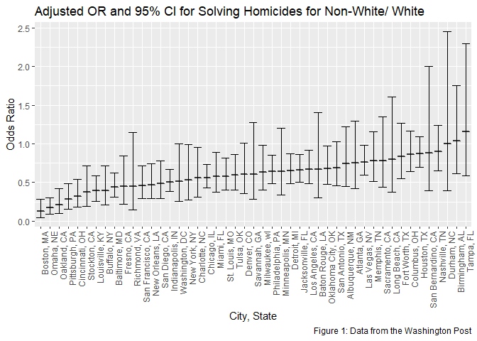
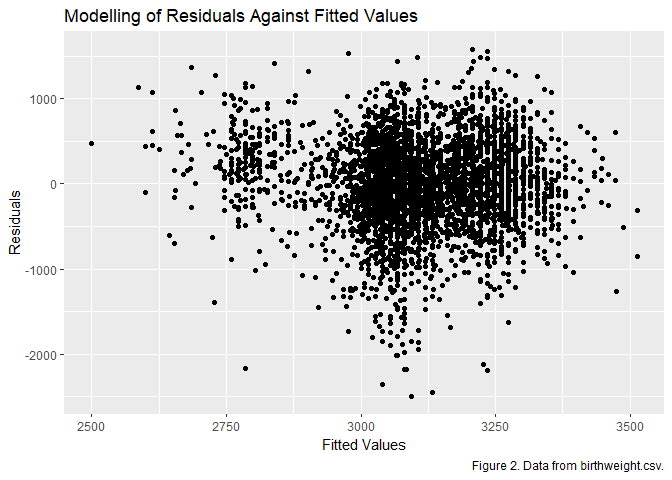
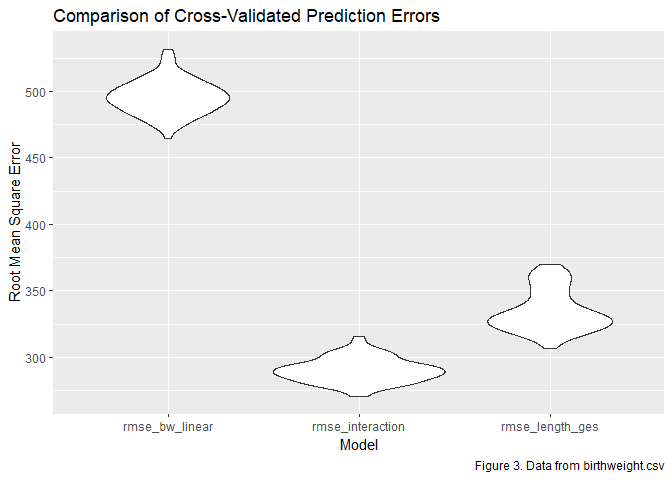

P8105\_HW6\_BJL2150
================
Briana Lettsome
November 27th, 2018

Problem 1
=========

### Description of the homicide dataset:

The homicide\_data provides information on the numbers of homicides committed within fifty large U.S. cities. Within the dataset, the observations included are the vitcims' first and last name, age, race, city and state that the event transpired in as well as the disposition. The disposition in this context refers to the result of the homicide event. In other words, was the case closed, an arrest made, unsolved, et cetera. This dataset will be read in and subsequently manipulated to complete Problem \#1. The main objective is to determine, among non-whites and whites, which group has the largest number of solved homicides.

``` r
# Reading in and cleaning of the homicide dataset.

homicide_data = read_csv("./homicidedata.csv", na = c("", "NA", "Unknown")) %>%
  janitor::clean_names()
```

    ## Parsed with column specification:
    ## cols(
    ##   uid = col_character(),
    ##   reported_date = col_integer(),
    ##   victim_last = col_character(),
    ##   victim_first = col_character(),
    ##   victim_race = col_character(),
    ##   victim_age = col_integer(),
    ##   victim_sex = col_character(),
    ##   city = col_character(),
    ##   state = col_character(),
    ##   lat = col_double(),
    ##   lon = col_double(),
    ##   disposition = col_character()
    ## )

Problem 1.1
-----------

### Making of the city-state variable and subsequent data manipulation.

``` r
# Making of the new variable 'city_state'. Also, created a binary variable from
# disposition and named this new observation 'solved',  Where 1 = "Closed by
# arrest" and 0 = "Open/ no arrest" and "Closed without arrest".

# Using this dataframe to count how many states are in the original dataset
# prior to filtering out the 4 city_state observations. 

two_homicide_citystate = homicide_data %>%
  mutate(city_state = str_c(city, ", " , state)) %>%
  mutate(solved = as.numeric(disposition == "Closed by arrest")) %>% 
  count(city_state)  

# This is the working dataframe where the 4 cities were filtered out
# successfully. I will be using this one going forward.

homicide_citystate = homicide_data %>%
  mutate(city_state = str_c(city, ", " , state)) %>% 
  mutate(solved = as.numeric(disposition == "Closed by arrest")) %>% 
  filter(!city_state %in% c("Dallas, TX", "Phoenix, AZ", "Kansas City, MO", "Tulsa, AL")) %>%
  select(city_state, victim_race, solved, victim_age, victim_sex, disposition) %>%
  mutate(race = case_when(victim_race == "White" ~ "white",
                          victim_race != "White" ~ "non-white")) %>%
  mutate(victim_age = as.numeric(victim_age)) %>%
  mutate(race = fct_relevel(race, "white")) %>%
  filter(race != "" & victim_age != "")
```

Problem 1.2
-----------

### Focusing only on Baltomre, MD.

``` r
# Filtering out of Baltimore, MD observation.

baltimore = homicide_citystate %>%
  filter(city_state == "Baltimore, MD")

## Using the 'glm' function to fit a logistic regression model.

glm(solved ~ victim_age + race + victim_sex, data = baltimore, family = binomial()) %>%
  broom::tidy(conf.int = TRUE) %>%
  mutate(OR = exp(estimate)) %>%
  mutate(exp_conf_low = exp(conf.low)) %>%
  mutate(exp_conf_high = exp(conf.high)) %>%
  select(term, OR, exp_conf_low, exp_conf_high, p.value) %>%
  knitr::kable(digits = 3)
```

| term            |     OR|  exp\_conf\_low|  exp\_conf\_high|  p.value|
|:----------------|------:|---------------:|----------------:|--------:|
| (Intercept)     |  3.274|           2.076|            5.212|    0.000|
| victim\_age     |  0.993|           0.987|            0.999|    0.032|
| racenon-white   |  0.441|           0.312|            0.620|    0.000|
| victim\_sexMale |  0.412|           0.315|            0.537|    0.000|

Problem 1.3
-----------

### Running the glm function on all city\_state variables.

``` r
# Use of the map function to run glm on all city_state variables.

city_state_glm = homicide_citystate %>%
  group_by(city_state) %>%
  nest()%>%
  mutate(models = map(data, ~glm(solved ~ victim_age + race + victim_sex, data = .x, family = binomial())),
models = map(models, broom::tidy, conf.int = TRUE)) %>%
  select(-data) %>% 
  unnest() %>%
  mutate(OR = exp(estimate),
       exp_conf_low = exp(conf.low),
       exp_conf_high = exp(conf.high))

# Made a tidy table showing onnly the OR estimates, confidence intervals and
# p-values.

city_state_glm %>%
  select(city_state, term, OR, exp_conf_low, exp_conf_high, p.value) %>%
  knitr::kable(digits = 3)
```

| city\_state        | term            |      OR|  exp\_conf\_low|  exp\_conf\_high|  p.value|
|:-------------------|:----------------|-------:|---------------:|----------------:|--------:|
| Albuquerque, NM    | (Intercept)     |   3.409|           1.608|            7.512|    0.002|
| Albuquerque, NM    | victim\_age     |   0.977|           0.963|            0.991|    0.001|
| Albuquerque, NM    | racenon-white   |   0.739|           0.445|            1.220|    0.240|
| Albuquerque, NM    | victim\_sexMale |   1.629|           0.917|            2.884|    0.094|
| Atlanta, GA        | (Intercept)     |   3.165|           1.574|            6.519|    0.001|
| Atlanta, GA        | victim\_age     |   0.988|           0.979|            0.997|    0.010|
| Atlanta, GA        | racenon-white   |   0.753|           0.424|            1.299|    0.317|
| Atlanta, GA        | victim\_sexMale |   0.990|           0.676|            1.439|    0.958|
| Baltimore, MD      | (Intercept)     |   3.274|           2.076|            5.212|    0.000|
| Baltimore, MD      | victim\_age     |   0.993|           0.987|            0.999|    0.032|
| Baltimore, MD      | racenon-white   |   0.441|           0.312|            0.620|    0.000|
| Baltimore, MD      | victim\_sexMale |   0.412|           0.315|            0.537|    0.000|
| Baton Rouge, LA    | (Intercept)     |   4.231|           1.591|           11.978|    0.005|
| Baton Rouge, LA    | victim\_age     |   0.997|           0.982|            1.011|    0.646|
| Baton Rouge, LA    | racenon-white   |   0.668|           0.304|            1.405|    0.296|
| Baton Rouge, LA    | victim\_sexMale |   0.389|           0.212|            0.687|    0.002|
| Birmingham, AL     | (Intercept)     |   1.955|           0.946|            4.088|    0.072|
| Birmingham, AL     | victim\_age     |   0.991|           0.981|            1.000|    0.055|
| Birmingham, AL     | racenon-white   |   1.039|           0.612|            1.754|    0.886|
| Birmingham, AL     | victim\_sexMale |   0.880|           0.580|            1.326|    0.544|
| Boston, MA         | (Intercept)     |  11.596|           4.062|           38.079|    0.000|
| Boston, MA         | victim\_age     |   1.004|           0.990|            1.019|    0.562|
| Boston, MA         | racenon-white   |   0.127|           0.047|            0.285|    0.000|
| Boston, MA         | victim\_sexMale |   0.472|           0.268|            0.814|    0.008|
| Buffalo, NY        | (Intercept)     |   1.729|           0.697|            4.380|    0.241|
| Buffalo, NY        | victim\_age     |   1.011|           0.997|            1.025|    0.120|
| Buffalo, NY        | racenon-white   |   0.392|           0.211|            0.714|    0.002|
| Buffalo, NY        | victim\_sexMale |   0.553|           0.317|            0.965|    0.037|
| Charlotte, NC      | (Intercept)     |   5.294|           2.472|           11.828|    0.000|
| Charlotte, NC      | victim\_age     |   0.996|           0.984|            1.008|    0.512|
| Charlotte, NC      | racenon-white   |   0.558|           0.313|            0.951|    0.038|
| Charlotte, NC      | victim\_sexMale |   0.872|           0.561|            1.332|    0.532|
| Chicago, IL        | (Intercept)     |   1.154|           0.819|            1.626|    0.412|
| Chicago, IL        | victim\_age     |   1.005|           1.001|            1.010|    0.028|
| Chicago, IL        | racenon-white   |   0.562|           0.432|            0.734|    0.000|
| Chicago, IL        | victim\_sexMale |   0.416|           0.348|            0.497|    0.000|
| Cincinnati, OH     | (Intercept)     |  10.553|           4.817|           24.476|    0.000|
| Cincinnati, OH     | victim\_age     |   0.990|           0.979|            1.002|    0.092|
| Cincinnati, OH     | racenon-white   |   0.318|           0.180|            0.541|    0.000|
| Cincinnati, OH     | victim\_sexMale |   0.394|           0.228|            0.657|    0.001|
| Columbus, OH       | (Intercept)     |   1.308|           0.810|            2.120|    0.274|
| Columbus, OH       | victim\_age     |   1.008|           0.999|            1.017|    0.081|
| Columbus, OH       | racenon-white   |   0.861|           0.638|            1.161|    0.325|
| Columbus, OH       | victim\_sexMale |   0.535|           0.382|            0.746|    0.000|
| Denver, CO         | (Intercept)     |   3.309|           1.486|            7.621|    0.004|
| Denver, CO         | victim\_age     |   0.990|           0.976|            1.004|    0.149|
| Denver, CO         | racenon-white   |   0.602|           0.358|            1.008|    0.054|
| Denver, CO         | victim\_sexMale |   0.428|           0.241|            0.748|    0.003|
| Detroit, MI        | (Intercept)     |   1.524|           1.027|            2.267|    0.037|
| Detroit, MI        | victim\_age     |   1.003|           0.997|            1.009|    0.359|
| Detroit, MI        | racenon-white   |   0.652|           0.488|            0.870|    0.004|
| Detroit, MI        | victim\_sexMale |   0.571|           0.454|            0.718|    0.000|
| Durham, NC         | (Intercept)     |   3.067|           1.035|            9.897|    0.050|
| Durham, NC         | victim\_age     |   0.994|           0.977|            1.011|    0.491|
| Durham, NC         | racenon-white   |   1.003|           0.390|            2.452|    0.995|
| Durham, NC         | victim\_sexMale |   0.628|           0.303|            1.241|    0.193|
| Fort Worth, TX     | (Intercept)     |   2.828|           1.495|            5.445|    0.002|
| Fort Worth, TX     | victim\_age     |   0.981|           0.970|            0.992|    0.001|
| Fort Worth, TX     | racenon-white   |   0.838|           0.553|            1.264|    0.401|
| Fort Worth, TX     | victim\_sexMale |   0.837|           0.546|            1.279|    0.414|
| Fresno, CA         | (Intercept)     |   7.104|           2.785|           19.378|    0.000|
| Fresno, CA         | victim\_age     |   0.998|           0.985|            1.010|    0.702|
| Fresno, CA         | racenon-white   |   0.445|           0.221|            0.841|    0.017|
| Fresno, CA         | victim\_sexMale |   0.538|           0.293|            0.947|    0.038|
| Houston, TX        | (Intercept)     |   1.760|           1.277|            2.430|    0.001|
| Houston, TX        | victim\_age     |   0.994|           0.989|            0.999|    0.011|
| Houston, TX        | racenon-white   |   0.873|           0.698|            1.090|    0.230|
| Houston, TX        | victim\_sexMale |   0.723|           0.596|            0.877|    0.001|
| Indianapolis, IN   | (Intercept)     |   2.915|           1.894|            4.531|    0.000|
| Indianapolis, IN   | victim\_age     |   0.993|           0.985|            1.001|    0.070|
| Indianapolis, IN   | racenon-white   |   0.505|           0.381|            0.665|    0.000|
| Indianapolis, IN   | victim\_sexMale |   0.876|           0.654|            1.171|    0.375|
| Jacksonville, FL   | (Intercept)     |   2.092|           1.377|            3.200|    0.001|
| Jacksonville, FL   | victim\_age     |   0.993|           0.986|            1.001|    0.085|
| Jacksonville, FL   | racenon-white   |   0.658|           0.502|            0.862|    0.002|
| Jacksonville, FL   | victim\_sexMale |   0.715|           0.535|            0.954|    0.023|
| Las Vegas, NV      | (Intercept)     |   2.321|           1.560|            3.475|    0.000|
| Las Vegas, NV      | victim\_age     |   0.995|           0.989|            1.002|    0.177|
| Las Vegas, NV      | racenon-white   |   0.763|           0.591|            0.981|    0.036|
| Las Vegas, NV      | victim\_sexMale |   0.940|           0.724|            1.218|    0.643|
| Long Beach, CA     | (Intercept)     |   2.426|           0.858|            7.256|    0.102|
| Long Beach, CA     | victim\_age     |   1.008|           0.994|            1.024|    0.274|
| Long Beach, CA     | racenon-white   |   0.794|           0.379|            1.606|    0.528|
| Long Beach, CA     | victim\_sexMale |   0.510|           0.262|            0.952|    0.040|
| Los Angeles, CA    | (Intercept)     |   1.817|           1.157|            2.872|    0.010|
| Los Angeles, CA    | victim\_age     |   1.004|           0.998|            1.010|    0.187|
| Los Angeles, CA    | racenon-white   |   0.666|           0.481|            0.916|    0.013|
| Los Angeles, CA    | victim\_sexMale |   0.673|           0.518|            0.872|    0.003|
| Louisville, KY     | (Intercept)     |   6.118|           3.168|           12.215|    0.000|
| Louisville, KY     | victim\_age     |   0.990|           0.978|            1.001|    0.078|
| Louisville, KY     | racenon-white   |   0.392|           0.257|            0.590|    0.000|
| Louisville, KY     | victim\_sexMale |   0.480|           0.296|            0.765|    0.002|
| Memphis, TN        | (Intercept)     |   5.892|           3.415|           10.354|    0.000|
| Memphis, TN        | victim\_age     |   0.984|           0.977|            0.992|    0.000|
| Memphis, TN        | racenon-white   |   0.778|           0.516|            1.154|    0.221|
| Memphis, TN        | victim\_sexMale |   0.719|           0.528|            0.970|    0.033|
| Miami, FL          | (Intercept)     |   1.485|           0.707|            3.149|    0.298|
| Miami, FL          | victim\_age     |   0.997|           0.985|            1.010|    0.669|
| Miami, FL          | racenon-white   |   0.577|           0.376|            0.885|    0.012|
| Miami, FL          | victim\_sexMale |   0.527|           0.315|            0.883|    0.015|
| Milwaukee, wI      | (Intercept)     |   4.934|           2.713|            9.190|    0.000|
| Milwaukee, wI      | victim\_age     |   0.988|           0.980|            0.997|    0.009|
| Milwaukee, wI      | racenon-white   |   0.632|           0.398|            0.982|    0.046|
| Milwaukee, wI      | victim\_sexMale |   0.747|           0.523|            1.056|    0.103|
| Minneapolis, MN    | (Intercept)     |   1.215|           0.484|            3.083|    0.678|
| Minneapolis, MN    | victim\_age     |   1.010|           0.995|            1.025|    0.213|
| Minneapolis, MN    | racenon-white   |   0.646|           0.341|            1.204|    0.172|
| Minneapolis, MN    | victim\_sexMale |   0.858|           0.458|            1.599|    0.628|
| Nashville, TN      | (Intercept)     |   2.023|           1.193|            3.471|    0.010|
| Nashville, TN      | victim\_age     |   0.997|           0.987|            1.007|    0.581|
| Nashville, TN      | racenon-white   |   0.902|           0.655|            1.239|    0.527|
| Nashville, TN      | victim\_sexMale |   1.017|           0.674|            1.519|    0.935|
| New Orleans, LA    | (Intercept)     |   3.077|           1.658|            5.765|    0.000|
| New Orleans, LA    | victim\_age     |   0.981|           0.971|            0.990|    0.000|
| New Orleans, LA    | racenon-white   |   0.467|           0.295|            0.739|    0.001|
| New Orleans, LA    | victim\_sexMale |   0.615|           0.446|            0.849|    0.003|
| New York, NY       | (Intercept)     |   5.152|           2.208|           12.721|    0.000|
| New York, NY       | victim\_age     |   1.009|           0.998|            1.020|    0.116|
| New York, NY       | racenon-white   |   0.532|           0.271|            0.989|    0.054|
| New York, NY       | victim\_sexMale |   0.342|           0.207|            0.546|    0.000|
| Oakland, CA        | (Intercept)     |   6.207|           2.736|           15.181|    0.000|
| Oakland, CA        | victim\_age     |   1.004|           0.994|            1.014|    0.403|
| Oakland, CA        | racenon-white   |   0.213|           0.099|            0.418|    0.000|
| Oakland, CA        | victim\_sexMale |   0.479|           0.323|            0.704|    0.000|
| Oklahoma City, OK  | (Intercept)     |   1.900|           1.117|            3.261|    0.019|
| Oklahoma City, OK  | victim\_age     |   0.995|           0.984|            1.005|    0.297|
| Oklahoma City, OK  | racenon-white   |   0.681|           0.477|            0.970|    0.034|
| Oklahoma City, OK  | victim\_sexMale |   0.824|           0.556|            1.218|    0.332|
| Omaha, NE          | (Intercept)     |  11.292|           4.655|           29.276|    0.000|
| Omaha, NE          | victim\_age     |   1.002|           0.986|            1.018|    0.776|
| Omaha, NE          | racenon-white   |   0.170|           0.091|            0.300|    0.000|
| Omaha, NE          | victim\_sexMale |   0.381|           0.202|            0.689|    0.002|
| Philadelphia, PA   | (Intercept)     |   3.707|           2.474|            5.601|    0.000|
| Philadelphia, PA   | victim\_age     |   1.000|           0.994|            1.005|    0.885|
| Philadelphia, PA   | racenon-white   |   0.644|           0.485|            0.850|    0.002|
| Philadelphia, PA   | victim\_sexMale |   0.466|           0.362|            0.596|    0.000|
| Pittsburgh, PA     | (Intercept)     |   4.588|           2.131|           10.271|    0.000|
| Pittsburgh, PA     | victim\_age     |   1.005|           0.992|            1.017|    0.452|
| Pittsburgh, PA     | racenon-white   |   0.282|           0.157|            0.485|    0.000|
| Pittsburgh, PA     | victim\_sexMale |   0.452|           0.277|            0.727|    0.001|
| Richmond, VA       | (Intercept)     |  10.181|           2.736|           44.069|    0.001|
| Richmond, VA       | victim\_age     |   0.980|           0.961|            0.999|    0.040|
| Richmond, VA       | racenon-white   |   0.447|           0.144|            1.150|    0.121|
| Richmond, VA       | victim\_sexMale |   0.932|           0.448|            1.844|    0.845|
| San Antonio, TX    | (Intercept)     |   3.075|           1.709|            5.609|    0.000|
| San Antonio, TX    | victim\_age     |   0.987|           0.978|            0.996|    0.006|
| San Antonio, TX    | racenon-white   |   0.689|           0.459|            1.026|    0.069|
| San Antonio, TX    | victim\_sexMale |   0.900|           0.633|            1.274|    0.556|
| Sacramento, CA     | (Intercept)     |   2.808|           1.191|            6.849|    0.020|
| Sacramento, CA     | victim\_age     |   1.004|           0.991|            1.018|    0.528|
| Sacramento, CA     | racenon-white   |   0.781|           0.443|            1.348|    0.381|
| Sacramento, CA     | victim\_sexMale |   0.599|           0.325|            1.065|    0.089|
| Savannah, GA       | (Intercept)     |   1.792|           0.612|            5.444|    0.292|
| Savannah, GA       | victim\_age     |   1.001|           0.982|            1.020|    0.935|
| Savannah, GA       | racenon-white   |   0.605|           0.279|            1.277|    0.193|
| Savannah, GA       | victim\_sexMale |   0.898|           0.434|            1.842|    0.770|
| San Bernardino, CA | (Intercept)     |   0.668|           0.178|            2.483|    0.546|
| San Bernardino, CA | victim\_age     |   1.012|           0.993|            1.032|    0.212|
| San Bernardino, CA | racenon-white   |   0.880|           0.394|            1.999|    0.756|
| San Bernardino, CA | victim\_sexMale |   0.640|           0.311|            1.323|    0.224|
| San Diego, CA      | (Intercept)     |   4.411|           2.004|           10.063|    0.000|
| San Diego, CA      | victim\_age     |   0.996|           0.984|            1.008|    0.478|
| San Diego, CA      | racenon-white   |   0.483|           0.294|            0.778|    0.003|
| San Diego, CA      | victim\_sexMale |   0.689|           0.421|            1.110|    0.132|
| San Francisco, CA  | (Intercept)     |   1.427|           0.638|            3.259|    0.391|
| San Francisco, CA  | victim\_age     |   1.024|           1.013|            1.036|    0.000|
| San Francisco, CA  | racenon-white   |   0.458|           0.288|            0.719|    0.001|
| San Francisco, CA  | victim\_sexMale |   0.540|           0.309|            0.922|    0.026|
| St. Louis, MO      | (Intercept)     |   2.196|           1.328|            3.657|    0.002|
| St. Louis, MO      | victim\_age     |   0.995|           0.987|            1.003|    0.197|
| St. Louis, MO      | racenon-white   |   0.577|           0.405|            0.819|    0.002|
| St. Louis, MO      | victim\_sexMale |   0.713|           0.538|            0.943|    0.018|
| Stockton, CA       | (Intercept)     |   1.592|           0.658|            3.923|    0.305|
| Stockton, CA       | victim\_age     |   0.999|           0.986|            1.012|    0.862|
| Stockton, CA       | racenon-white   |   0.376|           0.193|            0.713|    0.003|
| Stockton, CA       | victim\_sexMale |   1.034|           0.592|            1.835|    0.907|
| Tampa, FL          | (Intercept)     |   1.675|           0.547|            5.319|    0.371|
| Tampa, FL          | victim\_age     |   0.997|           0.979|            1.016|    0.769|
| Tampa, FL          | racenon-white   |   1.159|           0.585|            2.293|    0.671|
| Tampa, FL          | victim\_sexMale |   0.657|           0.292|            1.424|    0.295|
| Tulsa, OK          | (Intercept)     |   3.316|           1.898|            5.920|    0.000|
| Tulsa, OK          | victim\_age     |   0.995|           0.983|            1.006|    0.363|
| Tulsa, OK          | racenon-white   |   0.596|           0.406|            0.866|    0.007|
| Tulsa, OK          | victim\_sexMale |   0.997|           0.645|            1.527|    0.989|
| Washington, DC     | (Intercept)     |   4.372|           1.925|           10.355|    0.001|
| Washington, DC     | victim\_age     |   0.992|           0.984|            1.000|    0.063|
| Washington, DC     | racenon-white   |   0.514|           0.252|            0.997|    0.056|
| Washington, DC     | victim\_sexMale |   0.685|           0.469|            0.990|    0.046|

``` r
# Specifically selected out the estimates and both confidence intervals columns.
# Additonally, reordered the 'city_state' variable by the 'estimate' variable.

box_city_state = city_state_glm %>%
  filter(term == "racenon-white") %>%
  select(city_state, term, OR, exp_conf_low, exp_conf_high) %>%
  mutate(city_state = forcats::fct_reorder(city_state, OR)) %>%
  ggplot(aes(x = city_state, y = OR)) + geom_boxplot() +
  theme(axis.text.x = element_text(angle = 90, hjust = 1)) + 
  geom_errorbar(aes(ymin = exp_conf_low, ymax = exp_conf_high)) + 
  labs(
    title = "Adjusted OR and 95% CI for Solving Homicides for Non-White/ White",
    x = "City, State",
    y = "Odds Ratio",
    caption = "Figure 1: Data from the Washington Post"
  )

# Making of the boxplot with the inclusion of error bars for low and high CIs.
# Used the 'geoom_errorbar' to complete the latter step. 

box_city_state 
```



Figure 2 illustrates the estimate odds ratios and confidence intervals per city. Furthermore, these cities were organized by the estimated OR values. At first glance, the solved estimated oddds of solved homicides for non-white individuals varies throughout the region. According to the figure, Boston, MD had the smallest odds of solving homicides with the least amount of variability, while Tampa, Fl had the highest odds of solving homicides for non-white individuals. However, with the latter, there was quite a bit of variability observed. The city with the highest variability in solving homicides for non-white victims compared to whites was Durham, NC. This conclusion was made based on the wide errors bars surrounding the OR estimate which corrresponds to the 95% confidence intervals.

Problem 2
=========

Problem 2.1
-----------

### Description of Dataset

The birthweight dataset includes several variables that are proposed to be risk factors for a child's birthweight. Some of the variables include gestatioal age in weeks, baby's sex, baby's head circumference, baby's birth weight, family monthly income, mother's age at delivery and average number of cigarettes smoked per day during pregnancy. This dataset will be imported in order to address the questions in Problem 2. A proposed model will be created and compared to two other models using cross-validation.

``` r
# Reading in of birthweight dataset and removing ony observations that are missing, NA or Unknown.

birthweight_data = read_csv("./birthweight.csv", na = c("", "NA", "Unknown")) 
```

    ## Parsed with column specification:
    ## cols(
    ##   .default = col_integer(),
    ##   gaweeks = col_double(),
    ##   ppbmi = col_double(),
    ##   smoken = col_double()
    ## )

    ## See spec(...) for full column specifications.

Problem 2.2
-----------

### Linear Regression model for birthweight.

``` r
birthweight_clean = birthweight_data %>%
  select(bwt, momage, mrace, smoken, babysex, bhead, blength, gaweeks) 

bw_linear_one = lm(bwt ~ momage + mrace + smoken, data = birthweight_clean)

bw_linear_one %>%
  broom::tidy()
```

    ## # A tibble: 4 x 5
    ##   term        estimate std.error statistic  p.value
    ##   <chr>          <dbl>     <dbl>     <dbl>    <dbl>
    ## 1 (Intercept)  3110.       47.5      65.5  0.      
    ## 2 momage         13.3       1.98      6.70 2.42e-11
    ## 3 mrace        -141.       10.2     -13.8  1.53e-42
    ## 4 smoken         -8.64      1.04     -8.34 9.58e-17

### Proposed Model

The model that I propose includes mother's age at delivery, mother's race, and average number of cigarettes smoked per day during pregnancy. According to the Children's Hospital of Philadelphia, there are four risk factors for child's birthweight. From this, I chose to iclude the aformentioned predictors. In running a linear regression model, there was an observed statistical significance for all of the predictors. Therefore, they remained within my hypothesized linear model.

Problem 2.3
-----------

### Add::residuals and add::predictions to plot residuals against fitted values.

``` r
# Using the add::residuals and add:predictions to observe the output for my linear model.
modelr::add_residuals(birthweight_clean, bw_linear_one)
```

    ## # A tibble: 4,342 x 9
    ##      bwt momage mrace smoken babysex bhead blength gaweeks    resid
    ##    <int>  <int> <int>  <dbl>   <int> <int>   <int>   <dbl>    <dbl>
    ##  1  3629     36     1      0       2    34      51    39.9  182.   
    ##  2  3062     25     2      0       1    34      48    25.9  -98.2  
    ##  3  3345     29     1      1       2    36      50    39.9   -0.419
    ##  4  3062     18     1     10       1    34      52    40    -59.6  
    ##  5  3374     20     1      1       2    34      52    41.6  148.   
    ##  6  3374     23     1      0       1    33      52    40.7   99.6  
    ##  7  2523     29     2      0       2    33      46    40.3 -690.   
    ##  8  2778     19     1      0       2    33      49    37.4 -443.   
    ##  9  3515     13     1      0       1    36      52    40.3  373.   
    ## 10  3459     19     2      4       1    33      50    40.7  413.   
    ## # ... with 4,332 more rows

``` r
modelr::add_predictions(birthweight_clean, bw_linear_one)
```

    ## # A tibble: 4,342 x 9
    ##      bwt momage mrace smoken babysex bhead blength gaweeks  pred
    ##    <int>  <int> <int>  <dbl>   <int> <int>   <int>   <dbl> <dbl>
    ##  1  3629     36     1      0       2    34      51    39.9 3447.
    ##  2  3062     25     2      0       1    34      48    25.9 3160.
    ##  3  3345     29     1      1       2    36      50    39.9 3345.
    ##  4  3062     18     1     10       1    34      52    40   3122.
    ##  5  3374     20     1      1       2    34      52    41.6 3226.
    ##  6  3374     23     1      0       1    33      52    40.7 3274.
    ##  7  2523     29     2      0       2    33      46    40.3 3213.
    ##  8  2778     19     1      0       2    33      49    37.4 3221.
    ##  9  3515     13     1      0       1    36      52    40.3 3142.
    ## 10  3459     19     2      4       1    33      50    40.7 3046.
    ## # ... with 4,332 more rows

``` r
# Created a scatterplot plotting the residuals against the fitted values.

birthweight_clean %>% 
  modelr::add_residuals(bw_linear_one) %>% 
  modelr::add_predictions(bw_linear_one) %>%
  ggplot(aes(x = pred, y = resid)) + geom_point() +
    labs(
    title = "Modelling of Residuals Against Fitted Values",
    x = "Fitted Values",
    y = "Residuals",
    caption = "Figure 2. Data from birthweight.csv."
  )
```



Problem 2.3
-----------

### Comparison of My Model to the Two Others.

``` r
# The model that I hypothesized.

bw_linear_one = lm(bwt ~ momage + mrace + smoken, data = birthweight_clean)

# Making of the two comparison models.

length_ges_linear = lm(bwt ~ blength + gaweeks, data = birthweight_clean) 


linear_interaction = lm(bwt ~ bhead + blength + babysex + bhead*blength*babysex,
                        data = birthweight_clean)
```

This code chunk is used to create the cross-validated predicted error

``` r
validation_df = crossv_mc(birthweight_clean, 100) %>%
  mutate(train = map(train, as_tibble),
         test = map(test, as_tibble))

validation_df = validation_df %>%
  mutate(bw_linear_one = map(train, ~lm(bwt ~ momage + mrace + smoken, data = .x)), 
         length_ges_linear = map(train, ~lm(bwt ~ blength + gaweeks, data = .x)), 
         linear_interaction = map(train, ~lm(bwt ~ bhead + blength + babysex + bhead*blength*babysex, data = .x))) %>% 
  mutate(rmse_bw_linear = map2_dbl(bw_linear_one, test, ~rmse(model = .x, data = .y)),
         rmse_length_ges = map2_dbl(length_ges_linear, test, ~rmse(model = .x, data = .y)),
         rmse_interaction = map2_dbl(linear_interaction, test, ~rmse(model = .x, data = .y))) 

validation_df %>%
  select(.id, starts_with("rmse")) %>%
  gather(key = model, value = rmse, rmse_bw_linear:rmse_interaction) %>%
  ggplot(aes(x = model, y = rmse)) + geom_violin() +
  labs(
    title = "Comparison of Cross-Validated Prediction Errors",
    x = "Model",
    y = "Root Mean Square Error",
    caption = "Figure 3. Data from birthweight.csv"
  )
```



In looking at Figure 3, the model that I proposed, named rmse\_bw\_linear, on the plot, had the highest root mean square of the three models. Again, the predictors added to this model are mother's age at delivery, mother's race, and average number of cigarettes smoked per day during pregnancy. As such, on average, the data differs a lot from the predicted values. In looking at the figure, I would lean towards the model that is looking at the interaction among predictors (rmse\_interaction) since the root mean square is lower.
